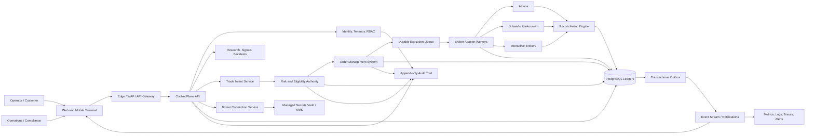
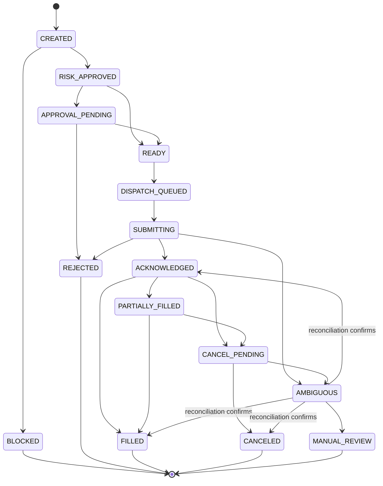

# OlbosTrade Master Architecture

**Version:** 1.0 draft  
**Date:** 2026-09-26  
**Status:** Target architecture and controlled migration plan  
**Implementation baseline:** `origin/main` at `2b3d55b`  
**Audience:** Product, engineering, security, operations, compliance, and broker-integration reviewers

---

## 1. Purpose and authority

OlbosTrade is a non-custodial, broker-neutral trading operations platform with optional systematic automation. It combines research, signals, portfolio intelligence, risk approval, order management, broker execution, reconciliation, and operator workflows. A trading bot is one workload within this platform; it is not the platform boundary.

This document defines:

- the current implementation baseline;
- the target institutional architecture;
- mandatory safety and trust boundaries;
- canonical records, states, APIs, and events;
- broker onboarding and switching behavior;
- security, reliability, testing, and operating requirements;
- a migration plan from the current application;
- the evidence required before production live trading.

This document is authoritative for system boundaries and safety invariants. It complements rather than replaces:

- `docs/trade-desk-2.0/MASTER_SPEC.md`, which remains authoritative for the Trade Desk product workflow and UI;
- `docs/ui-ux-phase1-4/PLAN.md`, which remains authoritative for progressive UI/UX improvement;
- `docs/runbook.md`, which remains the current operational runbook;
- `docs/broker-connection-architecture.md`, which becomes a subordinate broker-specific design and must be reconciled with this document;
- provider-specific implementation notes and Architecture Decision Records (ADRs).

Normative words such as **MUST**, **MUST NOT**, **SHOULD**, and **MAY** describe requirements for production qualification. A target described here is not evidence that it is already implemented.

---

## 2. Product and regulatory boundary

### 2.1 Intended product boundary

The preferred target is a platform in which:

- customers retain custody at their brokerage firm;
- customers authorize a broker connection using provider-approved mechanisms;
- OlbosTrade records and evaluates trade intent before execution;
- every executable intent passes centralized risk controls;
- brokers remain the authoritative source for accepted orders, fills, balances, and positions;
- OlbosTrade reconciles its internal records to each broker;
- Manual, Copilot, and Autopilot are permissioned execution modes over the same controlled pipeline;
- operators can stop activity without relying on a healthy strategy or market-data subsystem.

OlbosTrade MUST NOT claim to be an exchange, clearing firm, custodian, broker-dealer, investment adviser, or institutional OMS unless the business has the necessary legal status, agreements, controls, and evidence.

### 2.2 Mandatory operating-model decision

Before customer live trading, qualified securities counsel and compliance leadership MUST classify the intended service, including whether it is:

1. analytics and self-directed decision support;
2. non-discretionary order tooling;
3. customer-authorized automated trading;
4. discretionary investment management or robo-advice;
5. order routing or another broker-dealer activity.

The classification determines registration, disclosures, supervision, recordkeeping, marketing, best-execution, data-licensing, and customer-agreement requirements. Engineering design cannot substitute for this determination.

Relevant primary guidance includes:

- [SEC investment-adviser registration and Form ADV](https://www.sec.gov/about/divisions-offices/division-investment-management/electronic-filing-investment-advisers-iard/electronic-filing-investment-advisers-iard-how-register-sec-investment-adviser-how-file-reports-sec)
- [SEC Rule 15c3-5 market-access controls](https://www.sec.gov/rules-regulations/2011/06/risk-management-controls-brokers-or-dealers-market-access)
- [FINRA algorithmic-trading supervision and control guidance](https://www.finra.org/rules-guidance/key-topics/algorithmic-trading)

### 2.3 Explicit business non-goals until separately approved

- Custody of customer cash or securities
- Clearing and settlement
- Exchange or alternative-trading-system operation
- Unlicensed market-data redistribution
- Automatic copying of one customer account into another
- Cross-broker automatic order failover
- Crypto execution or custody before a separately approved legal, broker, market-data, and risk architecture
- Direct LLM-to-broker execution
- Naked short-options automation
- Unsupervised live 0DTE automation
- Claims of guaranteed returns or institutional certification without evidence

---

## 3. Current implementation baseline

GitHub `main` is the only valid baseline for future implementation. Local branches and uncommitted files are proposals until reconciled, reviewed, tested, and merged.

| Capability | Current baseline | Target disposition |
| --- | --- | --- |
| Frontend | React/Vite terminal with Trade Desk, research, risk, system, mobile workflows, and read-only crypto market views | Preserve; make all execution views consume canonical APIs and events |
| API | FastAPI application with many route-local service calls | Retain control-plane API; extract durable execution workers |
| Identity | Invite-only users, Argon2id passwords, revocable opaque database sessions | Retain initially; add organizations, roles, MFA, step-up auth, and service identities |
| Entitlements | Free/Pro/Elite limits enforced centrally | Retain; make entitlements organization-aware and policy-versioned |
| Broker credentials | Per-user encrypted Alpaca key pairs, verification, listing, and revocation | Migrate to provider-neutral connections and managed-vault references |
| Execution routing | Process-wide broker selected from environment configuration | Replace with immutable `broker_connection_id` and connection version on every intent |
| IBKR | Operator-level TWS/Gateway session | Keep as a controlled legacy adapter until an approved multi-account path exists |
| Schwab | Not implemented | Add only after provider approval and Alpaca execution certification |
| Crypto | Read-only market-data experience; no execution routing | Keep read-only until a separate regulated-scope, custody, venue, risk, and reconciliation design is approved |
| Risk | Substantial risk, kill-switch, portfolio, and reconciliation logic exists | Consolidate behind one non-bypassable risk authority |
| Order records | Trades and execution events exist, with some dispatch idempotency | Introduce canonical intent, OMS order, fill ledger, outbox, and inbox records |
| Background work | In-process `asyncio` scheduler and tasks | Move execution-critical work to durable supervised workers |
| Database | PostgreSQL via async SQLAlchemy and Alembic | Retain; add tenant isolation, append-only ledgers, partitioning/retention as needed |
| Deployment | Single backend container and frontend/reverse proxy; single-worker backend | Evolve to separately scalable control, execution, scheduler, and reconciliation services |
| Audit | Execution events and application logs | Add append-only, tamper-evident security and decision audit trail |
| Availability | Single-instance assumptions are embedded in the application | Remove critical single-process state before high-availability claims |

### 3.1 Baseline facts that MUST remain visible

- A stored customer broker connection on current `main` does not route that customer's orders.
- The process-wide broker singleton remains the execution path until explicitly replaced.
- Existing local migration `0029` proposals conflict with GitHub `main`, where broker connections are introduced in migration `0034`.
- The current single-process scheduler is not a durable job system.
- Existing safety features are valuable but do not yet form one provably non-bypassable order path.

---

## 4. Architectural principles

1. **Capital safety over availability.** When identity, risk, account, environment, broker state, or data freshness is uncertain, block execution.
2. **One execution path.** Manual, Copilot, Autopilot, scheduled, API, liquidation, and administrative orders enter the same intent and risk pipeline.
3. **Exactly-once effect, not exactly-once delivery.** Messages may be delivered more than once; idempotent records and broker correlation prevent duplicate economic effects.
4. **Brokers are execution truth.** Internal state is a projection that must be continuously reconciled to broker acknowledgements, orders, fills, positions, and balances.
5. **Identity is server-derived.** Browsers never choose an authoritative user, organization, account, tier, role, or broker connection identifier outside their authorized scope.
6. **Paper and live are different types.** Environment is explicit on connections, intents, orders, events, UI, metrics, and audit records.
7. **Secrets do not cross the client boundary.** The browser receives capability and status metadata, never reusable broker credentials or tokens.
8. **Automation is a permission, not a shortcut.** Higher automation changes who approves an eligible intent; it never bypasses risk, data, or reconciliation gates.
9. **Ambiguity stops execution.** An unknown broker submission outcome is reconciled before retry; it is never blindly resubmitted.
10. **Changes are reversible and attributable.** Configuration, strategy, risk, broker, and deployment changes carry an actor, reason, version, review, and rollback path.
11. **Target state is not current state.** UI and documentation clearly distinguish available, planned, degraded, simulated, paper, and live capabilities.
12. **Prefer simple durable boundaries.** Do not introduce distributed infrastructure unless it eliminates an identified failure mode and has operational ownership.

---

## 5. System context



### 5.1 Trust boundaries

| Boundary | Trusted responsibility | Prohibited behavior |
| --- | --- | --- |
| Browser | Collect intent, display status, request authorized actions | Final risk calculation, broker secret storage, direct broker order submission |
| Edge | TLS termination, request limits, coarse abuse protection | Business authorization decisions |
| Control plane | Authentication, authorization, validation, orchestration | Holding process-local execution truth |
| Risk authority | Final eligibility and sizing decision | Calling brokers directly |
| OMS | Durable order state and transition authority | Strategy selection or secret management |
| Broker worker | Provider translation and broker I/O | Changing approved economics or risk policy |
| Vault/KMS | Encryption and secret release to authorized workloads | Returning plaintext secrets to APIs or logs |
| Database | Durable metadata, ledgers, idempotency, audit linkage | Acting as a substitute for broker reconciliation |

---

## 6. Logical domains and ownership

### 6.1 Identity, tenancy, and authorization

Responsibilities:

- users, sessions, service identities, MFA, and step-up authentication;
- organizations and memberships;
- roles such as owner, administrator, trader, approver, viewer, and auditor;
- per-organization execution enablement;
- explicit live-trading permission;
- session revocation and device visibility.

The existing opaque-session design is a valid starting point. Replacing it with Clerk, Auth0, or another identity provider is a separate ADR, not an architectural prerequisite. Regardless of provider, application authorization remains server-side.

### 6.2 Entitlements and policy

Responsibilities:

- product tier and feature access;
- market-data entitlements;
- broker access;
- automation eligibility;
- account and organization limits;
- effective-dated policy versions.

Billing state MUST NOT directly authorize an order. It updates entitlements; the execution gateway evaluates a persisted entitlement snapshot with the intent.

### 6.3 Broker connection control plane

Responsibilities:

- provider authorization and callbacks;
- credential or token vault references;
- account discovery;
- environment and account verification;
- connection capabilities and granted scopes;
- token/session refresh;
- connection health and lifecycle;
- revocation and disconnect;
- controlled activation and switching.

It does not place orders. It produces an execution-ready connection reference for broker workers.

### 6.4 Market data and data quality

Responsibilities:

- quotes, bars, chains, Greeks, events, news, filings, macro, and reference data;
- provider provenance and licensing;
- timestamps, latency, completeness, and quality scores;
- delayed versus real-time classification;
- normalized instrument identifiers;
- execution-blocking freshness policy.

Every decision snapshot MUST identify the data used and its freshness. Missing or stale required data fails closed.

### 6.5 Research, signals, and strategy registry

Responsibilities:

- strategy definitions and immutable versions;
- backtests, walk-forward validation, and baselines;
- signal production and attribution;
- scenario and probabilistic analysis;
- model registry and health;
- promotion status: research, paper, limited live, live, suspended, retired.

Research results are evidence, not execution authority.

### 6.6 Trade intent and eligibility

Responsibilities:

- canonical broker-independent trade intent;
- provenance, rationale, invalidation, target, and expiry;
- immutable intent economics after approval;
- eligibility evaluation and block reasons;
- material-change detection and forced reevaluation.

### 6.7 Risk and portfolio authority

Responsibilities:

- account and portfolio snapshots;
- pre-trade financial, regulatory, liquidity, concentration, event, and strategy controls;
- buying-power and margin checks;
- options Greeks and assignment exposure;
- loss limits, drawdown, trade frequency, and cooldowns;
- kill-switch state;
- approved quantity and maximum risk;
- policy version and decision evidence.

Risk decisions are backend-authoritative and immutable. A stale approval cannot be reused after its expiry, material intent change, connection switch, account change, portfolio change beyond policy tolerance, or kill-switch transition.

### 6.8 Order Management System

Responsibilities:

- convert approved intents into canonical orders;
- assign stable client order identifiers;
- persist state before broker dispatch;
- manage submission, acknowledgement, partial fills, fills, cancel/replace, rejection, expiry, and ambiguity;
- enforce state transitions and idempotency;
- link parent/child and multi-leg orders;
- emit versioned order events through an outbox.

### 6.9 Broker adapters and execution workers

Responsibilities:

- consume a canonical order plus an immutable connection reference;
- retrieve secrets just in time through workload identity;
- translate instruments, quantities, prices, order types, and time-in-force;
- submit, cancel, replace, and query orders;
- normalize broker responses;
- respect provider limits, sessions, and idempotency semantics;
- never modify approved economics.

### 6.10 Portfolio ledger and reconciliation

Responsibilities:

- fill ledger and cash-impact records;
- internal order and position projections;
- broker snapshots;
- automated matching and discrepancy classification;
- resolution workflows and audit evidence;
- automation suspension on unresolved material mismatch.

### 6.11 Automation controller

Responsibilities:

- Manual, Copilot, and Autopilot modes;
- strategy allowlists;
- capital allocation and schedules;
- approval policies;
- automatic suspension and controlled resumption.

The controller creates intents. It cannot submit canonical orders directly.

### 6.12 Audit, compliance, and reporting

Responsibilities:

- authentication and authorization events;
- broker connection and secret lifecycle;
- strategy, risk, entitlement, and configuration changes;
- intent, approval, execution, reconciliation, and kill-switch decisions;
- actor, organization, request, correlation, policy, code, and deployment versions;
- retention, export, legal hold, and integrity verification.

---

## 7. Canonical data model

### 7.1 Identity and tenancy records

| Record | Key fields and invariants |
| --- | --- |
| `Organization` | Stable ID, legal/display name, status, execution-enabled flag, risk-policy ID |
| `User` | Stable ID, identity subject, status; disabling preserves audit identity |
| `Membership` | Organization, user, role, effective dates; unique active membership |
| `Session` | Hashed opaque token, expiry, revocation, device metadata |
| `EntitlementSnapshot` | Organization, tier, features, policy version, effective time |

### 7.2 Broker records

| Record | Key fields and invariants |
| --- | --- |
| `BrokerConnection` | Organization, provider, environment, status, vault reference, external account reference, capabilities, scopes, version |
| `BrokerAccountSnapshot` | Connection, broker timestamp, balances, buying power, margin, hash, freshness |
| `BrokerConnectionEvent` | Append-only lifecycle transition with actor/reason |
| `BrokerSwitchOperation` | Source, destination, state, idempotency key, evidence, approver, completion/failure |

Only one connection may be the active execution target for a given organization and execution scope. A partial unique database index MUST enforce the selected scope. Connection version increments on security- or routing-relevant change.

### 7.3 Decision and execution records

| Record | Purpose |
| --- | --- |
| `TradeIntent` | Immutable requested economics and provenance |
| `IntentEvaluation` | Eligibility and risk result with policy/data snapshots |
| `ApprovalDecision` | Manual or policy approval, actor, step-up evidence, expiry |
| `Order` | Canonical OMS order and current version/state |
| `OrderLeg` | Equity or option leg; multi-leg relationship |
| `OrderAttempt` | One broker-dispatch attempt with stable correlation ID |
| `OrderEvent` | Append-only state transition |
| `Fill` | Broker execution ID, quantity, price, fee, timestamp; unique per provider/account |
| `PositionProjection` | Derived internal position, never treated as unreconciled broker truth |
| `ReconciliationRun` | Scope, broker snapshot, differences, disposition |
| `AuditEvent` | Security/business event with integrity linkage |
| `OutboxEvent` | Transactionally persisted event awaiting publication |
| `InboxReceipt` | Consumer/event deduplication record |

### 7.4 Trade intent contract

Every executable intent MUST include at minimum:

```text
id
organization_id
requested_by_user_id or service_identity_id
source: manual | copilot | autopilot | liquidation | administrative
execution_mode
broker_connection_id
broker_connection_version
environment: paper | live
account_ref
asset_class
canonical_instrument_id
symbol_display
side
quantity or sizing_request
order_type
limit_price / stop_price where applicable
time_in_force
option_legs where applicable
strategy_id and strategy_version
signal_snapshot_id
entry_reason
invalidation
target
maximum_risk_request
data_as_of
created_at
expires_at
idempotency_key
correlation_id
```

The client may request a size. The risk authority determines the approved maximum size. Any material edit creates a new intent version and invalidates prior evaluations and approvals.

### 7.5 Order state machine



State transitions MUST use optimistic version checks. No route or adapter may update arbitrary state strings.

---

## 8. End-to-end order workflow

```mermaid
sequenceDiagram
    actor Operator
    participant UI
    participant API as Control Plane
    participant Risk
    participant DB as PostgreSQL + Outbox
    participant Worker as Execution Worker
    participant Broker
    participant Recon as Reconciliation

    Operator->>UI: Submit or approve intent
    UI->>API: Intent + idempotency key
    API->>API: Authenticate, authorize, resolve organization
    API->>Risk: Evaluate immutable intent snapshot
    Risk->>DB: Persist evaluation and evidence
    alt blocked or stale
        Risk-->>UI: Block reasons and remediation
    else approved
        API->>DB: Create OMS order + outbox event atomically
        DB-->>Worker: Publish dispatch event
        Worker->>Worker: Revalidate connection version and kill switch
        Worker->>Broker: Submit stable client order ID
        alt broker acknowledges
            Broker-->>Worker: Broker order ID and status
            Worker->>DB: Record acknowledgement/fills + outbox atomically
        else timeout or uncertain response
            Worker->>DB: Mark AMBIGUOUS; do not blind retry
            Worker->>Recon: Request broker lookup/reconciliation
        end
        Recon->>Broker: Fetch orders, fills, positions, balances
        Recon->>DB: Persist snapshot and differences
        DB-->>UI: Versioned status event
    end
```

### 8.1 Idempotency and dispatch rules

- The API requires an idempotency key for every mutating trading command.
- The database uniquely scopes the key to organization, command type, and relevant resource.
- The canonical order is committed before dispatch.
- Order creation and outbox creation occur in the same transaction.
- Consumers record inbox receipts before or with side effects.
- Provider-supported client order IDs use the stable OMS order ID or a deterministic derivative.
- A transport timeout after submission produces `AMBIGUOUS`, not an automatic resubmission.
- A retry is permitted only after broker lookup proves that no economic order exists, or when documented provider idempotency guarantees make it safe.
- Partial fills are first-class events. Remaining exposure is explicitly managed.

### 8.2 Cancellation and replacement

- Cancel and replace are separate idempotent commands.
- The OMS verifies the latest broker state before replacement when the prior outcome is uncertain.
- Multi-leg and bracket relationships are preserved.
- Protective orders are reconciled whenever a parent position changes.
- Closing a position MUST account for working orders that could reopen or reverse exposure.

---

## 9. Risk architecture

### 9.1 One risk gateway

All executable sources MUST call one risk authority. Existing risk modules should be composed behind this boundary rather than independently called by routes.

The risk authority evaluates:

1. identity, membership, role, and entitlement;
2. session recency and step-up requirement;
3. organization and account execution enablement;
4. paper/live environment agreement;
5. kill switches and incident state;
6. broker health, connection status, version, and account identity;
7. market session and instrument tradability;
8. data completeness and freshness;
9. strategy status and version;
10. liquidity, spread, price, and quantity sanity;
11. buying power, margin, and settlement constraints;
12. symbol, position, sector, correlation, and portfolio exposure;
13. options Greeks, assignment, expiration, and event risk;
14. daily/weekly/monthly loss and drawdown limits;
15. trade-frequency, cooldown, and concurrency limits;
16. requested versus approved size;
17. approval mode and evaluation expiry.

### 9.2 Risk decision output

The decision contains:

- `decision`: approved, review-required, or blocked;
- approved quantity and maximum risk;
- hard blocks and non-blocking warnings;
- risk-policy ID and version;
- portfolio/account snapshot identifiers;
- data snapshot and freshness;
- broker connection ID and version;
- evaluation timestamp and expiry;
- deterministic decision hash.

The UI may explain this output but MUST NOT recalculate or override it.

### 9.3 Kill-switch hierarchy

Kill switches exist at:

- platform;
- organization;
- broker connection/account;
- strategy;
- automation mode.

Engagement is immediate and idempotent. Reset requires a healthy dependency state, reconciliation, an authorized actor, recent step-up authentication, a reason, and audit evidence. Reset does not automatically resume Autopilot.

---

## 10. Automation model

| Mode | Intent creation | Approval | Execution pipeline |
| --- | --- | --- | --- |
| Manual | Human | Human confirmation | Canonical risk and OMS path |
| Copilot | System proposes | Authorized human approves | Same canonical path |
| Autopilot | Approved strategy policy | Policy approval within explicit envelope | Same canonical path |

Autopilot requires:

- strategy promoted for the specific asset class and environment;
- explicit organization/account/strategy allowlist;
- capital and loss envelope;
- fresh model and data health;
- broker and reconciliation health;
- an automatic suspension policy;
- a visible current mode in every execution surface.

Autopilot MUST suspend on material reconciliation mismatch, stale critical data, broker degradation, risk-service degradation, deployment safety trip, strategy-health breach, or connection change.

An LLM may summarize evidence or help draft an intent. It MUST NOT supply final quantity, override risk, hold broker secrets, or submit orders.

---

## 11. Broker connection architecture

### 11.1 Provider strategy

| Provider | Target authorization | Runtime | Delivery order |
| --- | --- | --- | --- |
| Alpaca | Approved OAuth 2 application; API-key bridge only during controlled migration | Stateless HTTPS per connection | First |
| Schwab / thinkorswim | Schwab Trader API OAuth 2 | HTTPS with managed token refresh | Second |
| Interactive Brokers | Approved third-party OAuth/Web API or separately approved institutional topology | Session-aware worker; no shared customer login | Third |

Primary references:

- [Alpaca OAuth and Trading API](https://docs.alpaca.markets/us/docs/using-oauth2-and-trading-api)
- [IBKR third-party OAuth registration](https://ibkrcampus.com/docs/web-api/authentication/oauth-1a/third-party-oauth/registration-process)
- [Schwab Developer Portal](https://developer.schwab.com/)

### 11.2 Connection lifecycle

```text
DRAFT -> AUTHORIZING -> VERIFYING -> READ_ONLY -> RECONCILING -> READY -> ACTIVE
                            |             |             |           |
                            +---------> DEGRADED <------+-----------+
                                         |
                                         +-> DISCONNECTED -> AUTHORIZING/VERIFYING

Any non-revoked connection can be REVOKED. REVOKED is terminal.
```

- `READ_ONLY` permits account discovery and snapshots, not orders.
- `READY` has passed verification and reconciliation but is not the selected execution connection.
- `ACTIVE` is selected for execution within its explicit scope.
- `DEGRADED` blocks new orders unless a narrowly documented safe mode exists.
- Revocation destroys reusable secret material and preserves non-secret history.

### 11.3 Safe broker switch saga

Switching is an audited saga, never a frontend preference:

1. Acquire an organization-level switch lock and idempotency key.
2. Force Manual mode and suspend new automated intents.
3. Stop new dispatches and drain or classify queued work.
4. Snapshot source orders, fills, positions, balances, and connection version.
5. Verify destination provider, account, environment, scopes, and freshness.
6. Reconcile destination broker state to internal records.
7. Present the operator with an explicit source/destination/environment diff.
8. Require step-up authentication and approval.
9. In one transaction, demote the source, activate the destination, increment routing epoch, and emit an outbox event.
10. Reject stale workers carrying the prior routing epoch.
11. Reconcile again and keep automation disabled.
12. Record immutable completion or failure evidence.

Automatic cross-broker failover is prohibited. A broker outage blocks and escalates; it does not replay an order at another provider.

### 11.4 Capability negotiation

Capabilities are discovered and stored per connection, not assumed from provider marketing. They include:

- asset classes;
- order and time-in-force types;
- multi-leg and bracket support;
- market-data entitlements;
- paper/live environment;
- option level and short-option permission;
- account restrictions;
- provider idempotency features;
- streaming and webhook availability.

The risk and intent validators reject features not proven for the selected connection.

---

## 12. Event architecture

### 12.1 Event envelope

Every domain event includes:

```text
event_id
event_type
schema_version
occurred_at
recorded_at
organization_id
aggregate_type
aggregate_id
aggregate_version
actor_type
actor_id
correlation_id
causation_id
environment
payload
```

### 12.2 Required event properties

- Events are immutable.
- Schemas are versioned and backward-compatible within a declared support window.
- Publication uses a transactional outbox.
- Consumers are idempotent and record inbox receipts.
- Retries use bounded exponential backoff with jitter.
- Poison events move to a dead-letter workflow with alerts.
- Sensitive values, tokens, customer account numbers, and unnecessary personal data do not enter payloads.
- Event retention and deletion follow the approved records policy.

### 12.3 Initial events

- `broker.connection.authorized`
- `broker.connection.verified`
- `broker.connection.degraded`
- `broker.connection.revoked`
- `broker.switch.requested`
- `broker.switch.completed`
- `trade_intent.created`
- `trade_intent.evaluated`
- `approval.recorded`
- `order.created`
- `order.dispatch_requested`
- `order.acknowledged`
- `order.partially_filled`
- `order.filled`
- `order.rejected`
- `order.cancel_requested`
- `order.canceled`
- `order.ambiguous`
- `reconciliation.completed`
- `reconciliation.mismatch_detected`
- `kill_switch.engaged`
- `kill_switch.reset`
- `automation.suspended`

---

## 13. API architecture

### 13.1 API rules

- Version public or long-lived APIs.
- Derive organization and user from the authenticated context.
- Require idempotency keys on trading mutations.
- Return stable machine codes plus safe human messages.
- Never echo secret input in validation errors.
- Use optimistic concurrency tokens for mutable configuration.
- Use cursor pagination for large ledgers.
- Separate commands from projections where it reduces accidental mutation.
- Apply rate limits by identity, organization, route class, and risk.
- Avoid exposing raw provider payloads.

### 13.2 Representative command surface

```text
POST   /api/v1/trade-intents
POST   /api/v1/trade-intents/{id}/evaluate
POST   /api/v1/trade-intents/{id}/approve
POST   /api/v1/orders/{id}/cancel
POST   /api/v1/orders/{id}/replace
GET    /api/v1/orders/{id}
GET    /api/v1/orders/{id}/events
GET    /api/v1/portfolio/snapshot
GET    /api/v1/reconciliation/latest
POST   /api/v1/broker-connections/{id}/verify
POST   /api/v1/broker-switches/preflight
POST   /api/v1/broker-switches/{id}/approve
POST   /api/v1/kill-switches/{scope}/engage
POST   /api/v1/kill-switches/{scope}/reset
```

These paths describe target resources, not a requirement to rewrite every existing endpoint immediately.

### 13.3 Real-time client updates

Use authenticated Server-Sent Events or WebSockets for order, position, risk, and health projections. The server sends resumable sequence IDs. Reconnect performs snapshot-then-stream so missed events do not create false state.

The real-time channel is a display optimization. Durable truth remains in APIs and the database.

---

## 14. Data architecture

### 14.1 PostgreSQL responsibilities

- identity, tenancy, and entitlement metadata;
- broker connection metadata and vault references;
- intent, risk, approval, OMS, fill, audit, reconciliation, outbox, and inbox ledgers;
- strategy registry and business configuration;
- consistent transactional boundaries.

Use row-level organization keys on all tenant-owned records. Add PostgreSQL row-level security only after operational ownership and tests exist; application authorization remains mandatory even with database policies.

### 14.2 Time-series and analytical data

Market history, features, backtest artifacts, and model artifacts may move to specialized stores when measured volume requires it. They MUST preserve:

- provider and license;
- instrument identity;
- event and ingestion timestamps;
- adjustment methodology;
- schema/version lineage;
- quality and completeness;
- reproducibility links.

Do not introduce a separate database merely for architectural appearance.

### 14.3 Data retention

Retention classes MUST be approved for:

- security and authentication logs;
- audit and decision records;
- orders, fills, and reconciliation evidence;
- customer configuration and broker metadata;
- market data and derived features;
- research experiments and model artifacts;
- operational telemetry.

Deletion, legal hold, backup retention, and customer requests must not silently corrupt required trading or audit history.

---

## 15. Security architecture

### 15.1 Identity and authorization

- MFA is required for live-trading roles.
- Step-up authentication is required for connecting/revoking a broker, switching accounts, enabling live mode, changing risk limits, resetting kill switches, and enabling Autopilot.
- Roles use least privilege and separation of duties where organizational size permits.
- Service-to-service calls use workload identity, not shared application keys.
- Sessions are revocable and visible to the user.
- High-risk changes can require two-person approval.

### 15.2 Secrets and cryptography

- Customer broker secrets and refresh tokens reside in a managed secret vault protected by KMS/HSM-backed keys.
- PostgreSQL stores opaque secret references and non-secret metadata.
- Secret access is short-lived, workload-scoped, audited, and denied to frontend/control-plane listing routes.
- Rotation and revocation are tested.
- Logs, traces, exceptions, analytics, and support tools redact secrets and full account identifiers.
- Encryption-key loss and compromise have documented recovery procedures.

### 15.3 Application and infrastructure security

- TLS everywhere; strict transport and secure-cookie policy.
- CSRF protection for cookie-authenticated mutations.
- Content Security Policy and safe browser headers.
- Input validation and canonical instrument parsing.
- Dependency, container, secret, and static analysis in CI.
- Signed release artifacts and provenance.
- Protected branches, required review, and environment approvals.
- Network segmentation between edge, control, workers, database, and vault.
- Restricted production access with recorded break-glass procedures.
- Regular penetration tests and remediation tracking.

Security governance SHOULD align with [NIST Cybersecurity Framework 2.0](https://www.nist.gov/cyberframework), and the software lifecycle SHOULD adopt [NIST SP 800-218 Secure Software Development Framework](https://csrc.nist.gov/pubs/sp/800/218/final).

### 15.4 Audit integrity

Audit events are append-only to application roles. Production deployment should use one or more of:

- database permissions denying updates/deletes;
- hash-linked event batches;
- signed periodic manifests;
- immutable object-storage export with retention lock;
- independent security log destination.

Audit integrity controls must be tested, not inferred from an ORM model named `AuditEvent`.

---

## 16. Reliability and failure behavior

### 16.1 Failure rules

| Failure | Required behavior |
| --- | --- |
| Risk authority unavailable | Reject new execution; existing broker orders remain monitored |
| Database unavailable before acceptance | Return failure; do not call broker |
| Database unavailable after broker submission | Mark/recover as ambiguous through correlation and reconciliation |
| Queue unavailable | Keep committed order pending; alert; do not bypass queue |
| Broker timeout | Mark ambiguous; query before retry |
| Market data stale | Block affected intents according to policy |
| Vault unavailable | Block new provider calls requiring secret retrieval |
| Reconciliation mismatch | Classify severity; suspend affected automation when material |
| Event stream unavailable | Preserve outbox; client falls back to snapshot polling |
| Worker crash | Lease expires; idempotent recovery continues from durable state |
| Region outage | Execute tested recovery plan; do not claim active-active order routing without proof |

### 16.2 Initial service objectives

These are target objectives to be ratified after measurement; they are not current claims.

| Objective | Initial target |
| --- | --- |
| Accepted intent durability | RPO 0 after successful API acknowledgement |
| Order/audit record integrity | 100% of accepted commands linked to actor, policy, and correlation IDs |
| Control-plane monthly availability | 99.9%, excluding declared maintenance |
| Execution acceptance monthly availability | 99.95% for Olbos-controlled dependencies, broker availability reported separately |
| Material reconciliation detection | Within 5 minutes during active sessions; immediate after reconnect or ambiguous submission |
| Critical alert delivery | Within 60 seconds of detection |
| Critical-service recovery objective | RTO 30 minutes initially, reduced after demonstrated drills |
| Non-ledger operational data | RPO no worse than 5 minutes |

Broker latency and availability MUST be measured separately from Olbos-controlled performance. User-facing status must not imply that an unavailable provider is an Olbos success or that a healthy Olbos API means a broker is executable.

### 16.3 Backup and disaster recovery

- PostgreSQL point-in-time recovery.
- Encrypted, access-controlled backups.
- Restore tests on a schedule.
- Separate backup account/project where practical.
- Vault backup/recovery consistent with provider-token rules.
- Rebuildable infrastructure from versioned configuration.
- Recovery runbooks with named owners.
- Post-recovery broker reconciliation before execution resumes.

---

## 17. Deployment topology

### 17.1 Target services

1. **Edge:** CDN/WAF/reverse proxy and TLS.
2. **Frontend:** immutable static build.
3. **Control API:** stateless authenticated APIs and read projections.
4. **Execution API/OMS:** tightly scoped order commands and state transitions.
5. **Execution workers:** isolated by provider and, where required, account/session.
6. **Scheduler:** durable scheduled jobs and strategy triggers.
7. **Reconciliation workers:** broker polling/stream processing and discrepancy workflow.
8. **Notification workers:** email/SMS/push/webhook delivery.
9. **PostgreSQL:** managed, highly available, point-in-time recovery.
10. **Durable queue/cache:** selected by ADR with persistence and operational ownership.
11. **Vault/KMS:** managed secret storage and encryption.
12. **Observability:** centralized metrics, logs, traces, alerting, and security events.

The first extraction can remain a modular monolith plus workers. Microservices are not a prerequisite; durable ownership and failure isolation are.

### 17.2 Environment separation

| Environment | Broker access | Data and purpose |
| --- | --- | --- |
| Local | Mocks or explicitly configured paper | Developer workstation; synthetic/non-sensitive data preferred |
| CI | Mocks and contract fixtures | Deterministic tests; no reusable broker secrets |
| Staging | Provider sandboxes/paper | Production-like topology and migrations |
| Paper production | Approved paper accounts | Operational soak and customer paper workflows |
| Limited live | Allowlisted accounts and capital caps | Canary with heightened monitoring and manual approval |
| Live | Approved accounts only | Full controls, support, compliance, and incident response |

Networks, databases, credentials, OAuth callbacks, and account identifiers are separate between paper and live. A UI toggle alone cannot change environments.

### 17.3 Release process

- Build once; promote the same signed artifact.
- Run schema compatibility checks before deployment.
- Use expand/migrate/contract database changes.
- Deploy with feature flags and explicit rollback criteria.
- Prevent two scheduler leaders and duplicate worker ownership.
- Run smoke tests against health, identity, intent, risk, queue, and broker-read paths.
- Reconcile before enabling execution after material deployment.
- Record deployment version on every decision and execution event.

---

## 18. Observability and operations

### 18.1 Required telemetry

Metrics are partitioned by environment, provider, connection-safe identifier, strategy, and result:

- intent creation, approval, block, and expiry;
- risk latency and block reasons;
- queue depth, oldest age, retry, and dead-letter count;
- dispatch attempts and ambiguous outcomes;
- broker response status and latency;
- order-state age and invalid transitions;
- fill and reconciliation lag;
- position and balance mismatches;
- connection/token/session health;
- kill switches and automation suspensions;
- data freshness and quality;
- authentication, authorization, and rate-limit failures.

Cardinality and privacy controls prevent raw account IDs, emails, symbols in unrestricted contexts, tokens, or free-form labels from becoming metric dimensions.

### 18.2 Alert classes

- **P0:** possible duplicate order, uncontrolled live execution, failed kill switch, integrity compromise.
- **P1:** ambiguous live order, material reconciliation mismatch, live execution dependency outage.
- **P2:** paper execution outage, sustained provider degradation, queue or data freshness breach.
- **P3:** noncritical feature degradation, delayed research job, capacity warning.

Every P0/P1 alert has an owner, runbook, acknowledgement target, escalation path, and post-incident review requirement.

### 18.3 Operator console

The System workspace should show:

- current environment and deployment version;
- active broker connection/account-safe identifier;
- connection state and last verification/reconciliation;
- execution mode and all kill switches;
- risk, data, queue, worker, and database health;
- unresolved ambiguous orders and reconciliation differences;
- recent configuration/deployment changes;
- clear next action with permission-aware controls.

---

## 19. Testing and validation strategy

### 19.1 Test layers

1. **Unit:** calculations, state machines, validation, authorization, transition rules.
2. **Property-based:** quantities, money precision, state transition invariants, idempotency.
3. **Contract:** each broker adapter against recorded fixtures and provider sandboxes.
4. **Integration:** PostgreSQL transactions, outbox/inbox, queue leases, vault access, callbacks.
5. **End-to-end:** user intent through broker paper fill and reconciliation.
6. **Replay:** deterministic reprocessing of production-shaped event sequences.
7. **Failure injection:** timeouts, duplicated messages, worker crashes, stale data, broker disconnects, database failover.
8. **Load:** market-open bursts, connection refresh, queue backlog, reconciliation fan-out.
9. **Security:** tenant isolation, authorization, CSRF, rate limits, secret leakage, dependency and penetration testing.
10. **Disaster recovery:** backup restoration, regional/service recovery, reconciliation before resume.

### 19.2 Non-negotiable execution tests

- Duplicate API request produces one intent/order.
- Duplicate queue delivery produces one broker economic effect.
- Crash before dispatch is recoverable.
- Crash after broker acceptance but before database update becomes ambiguous and reconciles.
- Partial fill followed by cancel preserves actual exposure.
- Cancel/replace races converge to broker truth.
- Stale risk approval cannot execute.
- Connection-version mismatch cannot execute.
- Paper intent cannot reach a live account.
- User and organization cannot access another tenant's connections or orders.
- Kill switch blocks every order source.
- Broker switch rejects stale workers and leaves automation disabled.
- Reconciliation mismatch triggers the configured suspension policy.

### 19.3 Strategy promotion gates

A strategy progresses through:

```text
RESEARCH -> BACKTESTED -> WALK_FORWARD_VALIDATED -> PAPER -> LIMITED_LIVE -> LIVE
```

Promotion requires versioned evidence, independent review, risk envelope, rollback/suspension rules, and minimum observation criteria approved by governance. Poor health can demote or suspend a strategy automatically.

---

## 20. Governance and change management

### 20.1 Required reviews

| Change | Minimum review |
| --- | --- |
| UI copy/layout without trading semantics | Product/design + tests |
| Trade intent or calculation | Engineering + risk-domain review |
| Risk rule or limit | Risk owner + engineering + audit record |
| Broker adapter behavior | Engineering + provider contract tests + paper certification |
| Authentication/authorization/secret handling | Security review |
| Database ledger/state transition | Architecture + migration review |
| Live enablement or capital increase | Operations + risk + compliance approval |

### 20.2 Architecture Decision Records

Create ADRs before committing to:

- legal operating model and regulated scope;
- organization tenancy model;
- identity provider versus existing session service;
- managed cloud and vault/KMS provider;
- durable queue technology;
- event schema and retention;
- OAuth versus temporary API-key bridge for Alpaca;
- IBKR integration model;
- market-data vendors and licenses;
- high-availability and disaster-recovery region strategy;
- audit immutability method;
- live SLOs and support coverage.

### 20.3 Evidence repository

Maintain versioned evidence for:

- threat model and data-flow diagrams;
- risk-control inventory and tests;
- provider approvals and agreements;
- market-data licenses;
- security assessments and remediation;
- disaster-recovery and incident exercises;
- strategy promotion decisions;
- production-change approvals;
- live canary results;
- regulatory and customer disclosures.

---

## 21. Migration plan from the existing platform

### Phase 0 — Repository and runtime alignment

Actions:

- preserve local UI work as a patch or reviewed commit;
- rebase or merge onto current GitHub `main`;
- remove the divergent local migration `0029` and extend after `0034` or the then-current head;
- reconcile duplicate broker models/routes with current main;
- establish one local Compose project and eliminate legacy port/container conflicts;
- migrate the local database through the canonical chain;
- run the full backend and frontend suites.

Exit criteria:

- no migration revision collision;
- clean branch based on current main;
- local runtime matches repository configuration;
- all preserved UI changes are reviewed and tested.

### Phase 1 — Canonical identity and execution records

Actions:

- add organizations, memberships, roles, execution enablement, and step-up evidence;
- evolve broker connections to organization ownership or an explicitly approved account-ownership model;
- introduce TradeIntent, IntentEvaluation, ApprovalDecision, Order, OrderEvent, OrderAttempt, Fill, OutboxEvent, and InboxReceipt;
- implement state-machine and idempotency constraints;
- wrap existing risk services behind one risk authority.

Exit criteria:

- every paper order source creates the same intent contract;
- no frontend or strategy calls a concrete broker directly;
- database constraints enforce core invariants.

### Phase 2 — Tenant-aware Alpaca paper execution

Actions:

- implement connection-scoped Alpaca clients;
- replace route-level global broker use for the selected paper pilot path;
- add durable dispatch worker and outbox/inbox;
- implement ambiguous-order recovery and scheduled reconciliation;
- add organization/account kill switches and operator UI.

Exit criteria:

- paper order end-to-end test passes from intent through reconciliation;
- restart, duplicate, timeout, and partial-fill tests pass;
- credentials never appear in browser, logs, or events;
- automation remains off by default.

### Phase 3 — Execution hardening and worker extraction

Actions:

- route every order source through canonical execution;
- move critical schedules to durable workers;
- add queue/dead-letter operations;
- implement append-only audit export;
- establish SLO dashboards, paging, backup restoration, and recovery drills;
- remove process-wide broker selection from customer execution.

Exit criteria:

- no known bypass around the risk/OMS pipeline;
- worker failover and database recovery are demonstrated;
- operator runbooks and alerts are validated.

### Phase 4 — Alpaca limited-live canary

Actions:

- complete provider approval and production OAuth path;
- obtain legal/compliance approval and customer agreements;
- allowlist accounts with small capital/order caps;
- require Manual mode and step-up confirmation initially;
- run heightened reconciliation and human monitoring.

Exit criteria:

- live canary has no unexplained order or position divergence;
- incident, rollback, support, and disclosure processes are operational;
- formal decision authorizes expansion.

### Phase 5 — Schwab integration

Actions:

- implement approved OAuth, refresh, revocation, capability discovery, adapter, contract suite, and reconciliation;
- certify paper/sandbox behavior before limited live;
- preserve the same canonical intent, risk, OMS, audit, and worker model.

Exit criteria:

- Schwab introduces no provider-specific bypass or fork in business policy;
- provider certification and limited-live gates pass.

### Phase 6 — IBKR integration

Actions:

- complete vendor onboarding and select an approved Web API/session topology;
- isolate session lifecycle and account identity;
- implement live-session renewal, brokerage-session initialization, provider throttling, and reconnect reconciliation;
- certify the adapter through the same gates.

Exit criteria:

- multi-account isolation is proven;
- reconnect, session expiry, and ambiguous execution drills pass;
- no customer password is collected by OlbosTrade.

### Phase 7 — Institutional operating maturity

Actions:

- complete external penetration testing and remediation;
- establish recurring access review, incident exercises, and vendor-risk review;
- demonstrate SLOs over an agreed observation window;
- complete compliance evidence, retention, support, and business-continuity programs;
- consider independent assurance such as SOC 2 only when controls operate consistently enough to audit.

Exit criteria:

- all criteria in Section 22 have objective evidence and named owners.

---

## 22. Institutional completion criteria

OlbosTrade may describe a release as an institutional-grade production platform only when all applicable criteria are evidenced:

### Legal and commercial

- Operating model classified and approved by qualified counsel.
- Required registrations, agreements, disclosures, supervision, and records policies are active.
- Broker/vendor applications and production permissions are approved.
- Market-data use and redistribution are licensed.
- Customer agreements accurately describe automation, risk, outages, and responsibility.

### Execution safety

- Every order source passes through one intent, risk, approval, OMS, and worker path.
- Idempotency and ambiguity handling prevent blind duplicate submission.
- Partial fills, cancels, replacements, brackets, and multi-leg orders reconcile correctly.
- Paper/live and account identity cannot be confused.
- Kill switches and automation suspension work during injected failures.

### Tenancy and security

- Tenant isolation is covered by automated tests and external review.
- MFA, step-up, RBAC, service identity, and secret-vault controls operate in production.
- No reusable broker secret is exposed to browsers, logs, telemetry, or audit payloads.
- Security monitoring, incident response, vulnerability management, and access review are operational.

### Reliability and operations

- Accepted order records meet the approved durability objective.
- Queue, worker, database, provider, and region/service failures have been exercised.
- Backups restore successfully and recovery includes broker reconciliation.
- SLOs, alerts, on-call ownership, and runbooks operate over the approved observation period.
- No unresolved P0/P1 control deficiency remains.

### Audit and governance

- Every order is attributable to identity, strategy, data, risk, policy, connection, and deployment versions.
- Audit integrity and retention are independently verifiable.
- Strategy promotion and risk-limit changes require documented evidence and approval.
- Releases are reproducible, signed, reviewed, and reversible.

### Product truthfulness

- UI never presents planned, stale, delayed, simulated, paper, or degraded data as live/available.
- Broker connection does not imply execution routing until routing is active and verified.
- Performance and model claims state dataset, period, assumptions, limitations, and source.
- Mobile and desktop critical workflows meet accessibility and safety requirements.

Institutional quality is an operating condition maintained through evidence, monitoring, review, and drills. It is not permanently achieved by completing a feature list.

---

## 23. Immediate next decisions

The following decisions block efficient implementation and should be resolved in order:

1. Approve the intended legal/product operating model.
2. Reconcile the current local branch with GitHub `main`.
3. Choose organization/account ownership semantics for broker connections.
4. Approve the canonical intent, risk decision, and OMS records.
5. Select the durable queue/outbox deployment pattern.
6. Select managed vault/KMS and production cloud topology.
7. Decide whether Alpaca API keys remain a temporary bridge or OAuth is mandatory before tenant-aware execution.
8. Define the first paper pilot scope, supported orders, risk envelope, and exit criteria.

The recommended first implementation milestone is narrow:

> One authenticated organization, one verified Alpaca paper connection, one canonical equity order type, one non-bypassable risk decision, one durable dispatch worker, and one complete reconciliation trail—with duplicate, timeout, crash, stale-data, and kill-switch tests passing.

Completing that vertical slice establishes the safety model every later asset class, strategy, broker, and automation mode must reuse.

---

## Appendix A — Existing repository assets to preserve

- Trade Desk shell, equity/options desks, Copilot, execution monitor, and responsive design
- Shared `BrokerInterface` normalization concepts
- Alpaca and IBKR client knowledge
- Risk manager, unified risk, portfolio gate, kill switch, and trading-mode controls
- Position reconciler and reconciliation snapshots
- Execution events and dispatch correlation IDs
- Invite-only authentication and revocable opaque sessions
- Central tier-limit policy
- Encrypted per-user Alpaca credential service and safe serialization
- Strategy registry, backtesting, replay, journal, signal attribution, and data-quality UX
- Existing tests that encode production-discovered edge cases

Preservation means adapting these assets behind canonical boundaries, not freezing their current coupling.

## Appendix B — Glossary

| Term | Meaning |
| --- | --- |
| Control plane | Identity, configuration, intent, policy, and orchestration APIs |
| Execution data plane | Durable order dispatch, broker I/O, fills, and reconciliation |
| OMS | Order Management System; canonical order state authority |
| Intent | Requested trade economics and provenance before execution |
| Evaluation | Versioned eligibility and risk decision for an intent |
| Outbox | Events committed transactionally with domain state and published later |
| Inbox | Consumer deduplication record for processed events |
| Ambiguous order | Submission whose broker outcome is unknown and must be reconciled |
| Routing epoch | Version that invalidates workers after an execution-connection change |
| Copilot | System proposes; human approves |
| Autopilot | Approved policy may approve within a strict envelope |
| Reconciliation | Comparison of internal projections with broker truth |
| Step-up authentication | Recent stronger authentication required for a high-risk action |
| Fail closed | Refuse execution when required safety evidence is missing or uncertain |
